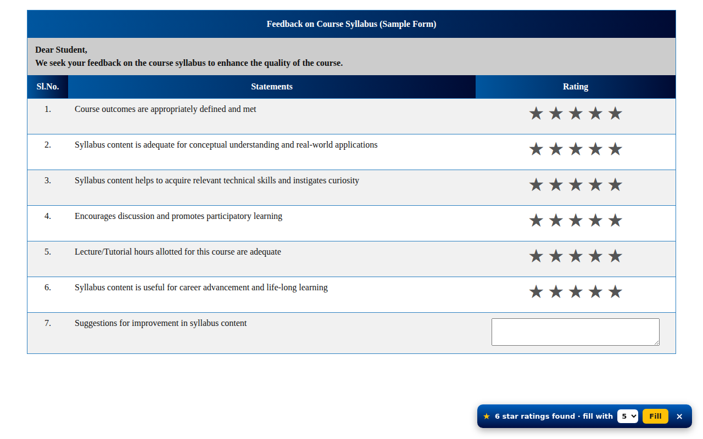

# ★ StarFill: Feedback Form Rater

A tiny Chrome extension that shows a one-click bar on feedback forms containing star ratings, so you can set every rating at once.

## Features
- Appears automatically, only on pages with 3+ star-rating fields
- Choose 1–5 stars, press **Fill**; you review and submit yourself
- Leaves text boxes and multiple-choice questions untouched
- Disabled on shopping, app-store, maps and review sites

## Privacy first
No permissions, no network requests, no analytics, nothing stored. Everything runs locally in your browser. See [PRIVACY_POLICY.md](PRIVACY_POLICY.md). The entire logic is one readable file: [`extension/content.js`](extension/content.js).

## Install manually (developer mode)
1. Download this repo (Code → Download ZIP) and unzip it.
2. Open `chrome://extensions` and turn on **Developer mode**.
3. Click **Load unpacked** and choose the **`extension`** folder (the one containing `manifest.json`).

## Use responsibly
Give honest ratings where your opinion matters. Not affiliated with any institution or website.

## License
MIT
